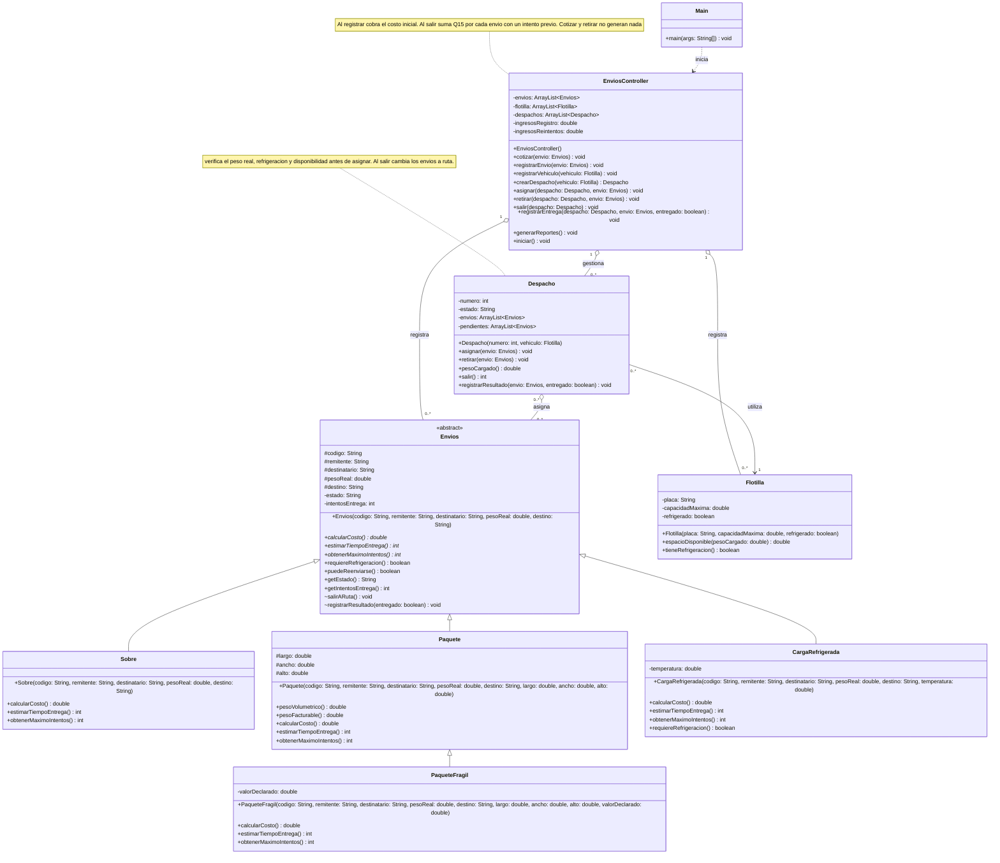

```mermaid
classDiagram
    direction TB

    class Main {
        +main(args: String[]) void
    }

    class EnviosController {
        -envios: ArrayList~Envios~
        -flotilla: ArrayList~Flotilla~
        -despachos: ArrayList~Despacho~
        -ingresosRegistro: double
        -ingresosReintentos: double
        +EnviosController()
        +cotizar(envio: Envios) void
        +registrarEnvio(envio: Envios) void
        +registrarVehiculo(vehiculo: Flotilla) void
        +crearDespacho(vehiculo: Flotilla) Despacho
        +asignar(despacho: Despacho, envio: Envios) void
        +retirar(despacho: Despacho, envio: Envios) void
        +salir(despacho: Despacho) void
        +registrarEntrega(despacho: Despacho, envio: Envios, entregado: boolean) void
        +generarReportes() void
        +iniciar() void
    }

    class Envios {
        <<abstract>>
        #codigo: String
        #remitente: String
        #destinatario: String
        #pesoReal: double
        #destino: String
        -estado: String
        -intentosEntrega: int
        +Envios(codigo: String, remitente: String, destinatario: String, pesoReal: double, destino: String)
        +calcularCosto()* double
        +estimarTiempoEntrega()* int
        +obtenerMaximoIntentos()* int
        +requiereRefrigeracion() boolean
        +puedeReenviarse() boolean
        +getEstado() String
        +getIntentosEntrega() int
        ~salirARuta() void
        ~registrarResultado(entregado: boolean) void
    }

    class Sobre {
        +Sobre(codigo: String, remitente: String, destinatario: String, pesoReal: double, destino: String)
        +calcularCosto() double
        +estimarTiempoEntrega() int
        +obtenerMaximoIntentos() int
    }

    class Paquete {
        #largo: double
        #ancho: double
        #alto: double
        +Paquete(codigo: String, remitente: String, destinatario: String, pesoReal: double, destino: String, largo: double, ancho: double, alto: double)
        +pesoVolumetrico() double
        +pesoFacturable() double
        +calcularCosto() double
        +estimarTiempoEntrega() int
        +obtenerMaximoIntentos() int
    }

    class PaqueteFragil {
        -valorDeclarado: double
        +PaqueteFragil(codigo: String, remitente: String, destinatario: String, pesoReal: double, destino: String, largo: double, ancho: double, alto: double, valorDeclarado: double)
        +calcularCosto() double
        +estimarTiempoEntrega() int
        +obtenerMaximoIntentos() int
    }

    class CargaRefrigerada {
        -temperatura: double
        +CargaRefrigerada(codigo: String, remitente: String, destinatario: String, pesoReal: double, destino: String, temperatura: double)
        +calcularCosto() double
        +estimarTiempoEntrega() int
        +obtenerMaximoIntentos() int
        +requiereRefrigeracion() boolean
    }

    class Flotilla {
        -placa: String
        -capacidadMaxima: double
        -refrigerado: boolean
        +Flotilla(placa: String, capacidadMaxima: double, refrigerado: boolean)
        +espacioDisponible(pesoCargado: double) double
        +tieneRefrigeracion() boolean
    }

    class Despacho {
        -numero: int
        -estado: String
        -envios: ArrayList~Envios~
        -pendientes: ArrayList~Envios~
        +Despacho(numero: int, vehiculo: Flotilla)
        +asignar(envio: Envios) void
        +retirar(envio: Envios) void
        +pesoCargado() double
        +salir() int
        +registrarResultado(envio: Envios, entregado: boolean) void
    }

    Envios <|-- Sobre
    Envios <|-- Paquete
    Paquete <|-- PaqueteFragil
    Envios <|-- CargaRefrigerada
    Main ..> EnviosController : inicia
    EnviosController "1" o-- "0..*" Envios : registra
    EnviosController "1" o-- "0..*" Flotilla : registra
    EnviosController "1" o-- "0..*" Despacho : gestiona
    Despacho "0..*" --> "1" Flotilla : utiliza
    Despacho "0..*" o-- "0..*" Envios : asigna

    note for Despacho "verifica el peso real, refrigeracion y disponibilidad antes de asignar. Al salir cambia los envios a ruta."
    note for EnviosController "Al registrar cobra el costo inicial. Al salir suma Q15 por cada envio con un intento previo. Cotizar y retirar no generan nada"
```